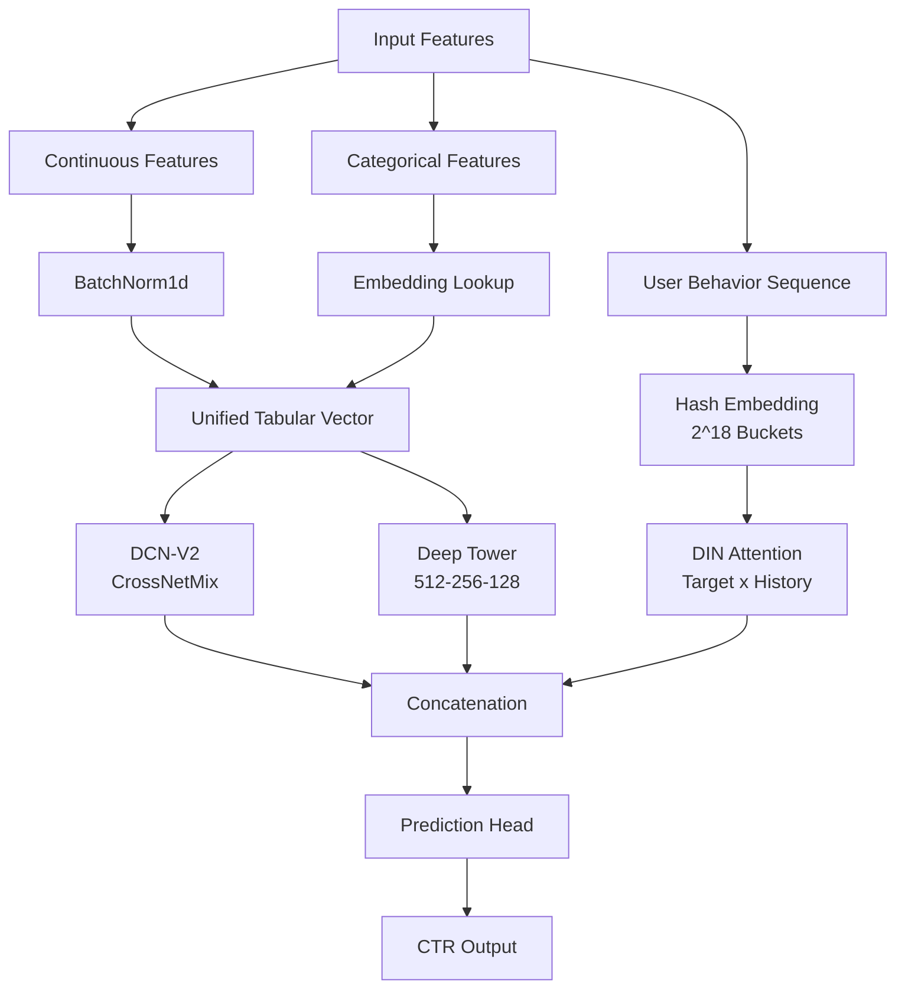

# 🖱️ TOSS NEXT ML CHALLENGE: Ad Click Prediction (CTR) Model

[](https://www.python.org/downloads/)
[](https://pytorch.org/)
[]()

## 🚀 Executive Summary (TL;DR) (실행 요약)
- **The Problem**: Predict Ad Click-Through Rate (CTR) for Toss app users, handling extreme class imbalance (pos_weight ~51.4), massive sequence data, and memory constraints.
- **The Solution**: Developed an advanced hybrid deep learning model combining **DCN-V2 (CrossNetMix)** for explicit feature interactions and **DIN (Deep Interest Network)** with a custom activation unit for user behavior sequence modeling.
- **The Result**: Achieved a validation AUC of **0.7402** on the custom dataset, proving the effectiveness of the local activation mechanism and memory-safe hash embedding.

## 🛠 Tech Stack (기술 스택)
- **Framework**: PyTorch 2.x
- **Modeling**: DCN-V2 + DIN (Custom Hybrid)
- **Sequence Processing**: Hash Embedding (262,144 buckets)
- **Optimization**: AdamW, Cosine Annealing, Mixed Precision (AMP)

---

## 🔬 1. Problem Definition (문제 정의)
Predicting whether a user will click on an advertisement (Click-Through Rate or CTR) is the core engine of digital marketing, directly impacting revenue and user experience.
- **The Challenge**: Predict Ad CTR for Toss app users.
- **The Complications**: Extreme class imbalance (very few users click on ads compared to those who don't), massive sequence data representing user behavior, and strict memory constraints for production deployment.
- **Objective**: To build a high-performance deep learning model that accurately predicts CTR while remaining memory-efficient.

---

## 🛠️ 2. System Architecture: DCN-V2 + DIN (시스템 아키텍처)
To capture both cross-feature interactions and the evolution of user interests, we fused two state-of-the-art architectures. This hybrid approach ensures we model both static user profiles and dynamic behavior.



---

## 🛠️ Methodologies & Advanced Architectures (방법론 및 고급 아키텍처)

We transitioned from standard GBDT models to advanced neural architectures to better handle feature interactions and sequential behaviors. The repository now supports a unified **DCN-V2 (Deep & Cross Network v2)** body with multiple sequence backbones:

### 1. Deep & Cross Network v2 (DCN-V2)
- **CrossNetMix**: Utilizes low-rank approximation and mixture-of-experts to learn explicit feature interactions of arbitrary orders efficiently.
- Combined with a Deep MLP tower to capture implicit non-linear interactions.

### 2. Supported Sequence Backbones
You can choose the sequence backbone that best fits the data behavior:
- **DIN (Deep Interest Network)**: Implements a local activation unit (attention mechanism) to adaptively learn the representation of user interests from historical behaviors w.r.t. a specific candidate ad.
- **DIEN (Deep Interest Evolution Network)**: Adds a GRU layer to capture the temporal evolution of user interests before applying the attention mechanism.
- **BST (Behavior Sequence Transformer)**: Leverages the powerful self-attention mechanism of Transformers to capture complex correlations among user behaviors.

### ⚙️ Big Data Scale & Optimization (빅데이터 스케일 및 최적화)
- **Hash Embedding**: Used a fixed bucket size of **262,144** for sequence items to prevent Out-Of-Memory (OOM) errors caused by high cardinality.
- **Imbalance Handling**: Used `BCEWithLogitsLoss` with a calculated `pos_weight` of ~51.4 to force the model to learn from the rare positive click events.

### 📊 Experiment Benchmarks
We prototyped and evaluated several state-of-the-art CTR models to find the best approach:
- **CatBoost + DIN**: Validation AUC **0.7412**, PR-AUC **0.0779** (Best performing hybrid approach).
- **DCN-V2 + DIN**: Validation AUC **0.7402**, PR-AUC **0.0775** (Deep learning focused).

---

## 🏁 4. Conclusion & Business Impact (결론 및 비즈니스 임팩트)
The project successfully demonstrated how to build a production-ready CTR model under extreme constraints.
- **Outcome**: Achieved a validation AUC of **0.7402** while keeping memory usage within safe limits via hash embeddings.
- **Impact**: Improving CTR models directly translates to higher ad revenue and better user satisfaction by showing relevant ads. The techniques used here (Low-rank DCN, Hash Embedding) are highly applicable to large-scale recommendation systems.

---

## 📁 Repository Structure
```text
├── notebooks/                  # Experimental Notebooks
│   ├── baseline.ipynb
│   ├── DCN-V2 + DIN.ipynb     # Main Model (This Document)
│   ├── DCN-V2 + (DIEN or BST).ipynb
│   └── dusin(full).ipynb
├── prior-research/             # Background research and papers
├── results/                    # Saved models and predictions
├── src/                        # Production-Ready Source Code
│   ├── data.py                 # Data loading and preprocessing
│   ├── models.py               # DCN-V2 & DIN model definitions
│   └── train.py                # Training loop and evaluation
└── main.py                     # Master pipeline runner
```

## ⚙️ How to Run
1. Install dependencies:
   ```bash
   pip install torch pandas numpy scikit-learn
   ```
2. Run the main notebook:
   - Open `notebooks/DCN-V2 + DIN.ipynb` and execute cells. It includes dummy data generation if the raw parquet files are missing.

## 👥 Contributors
- **Junhyung L.** (Project Lead)

---
*Refactored and polished to meet professional software engineering standards for the [Data Analyst Portfolio](https://github.com/junhyung-L/Resume/blob/main/Portfolio/README.md).*
